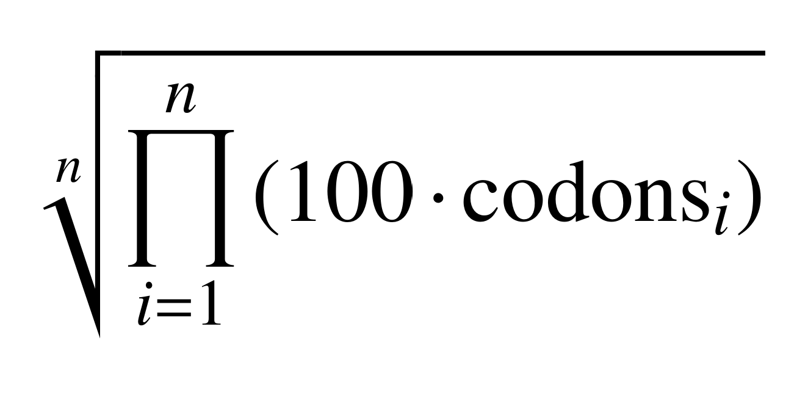
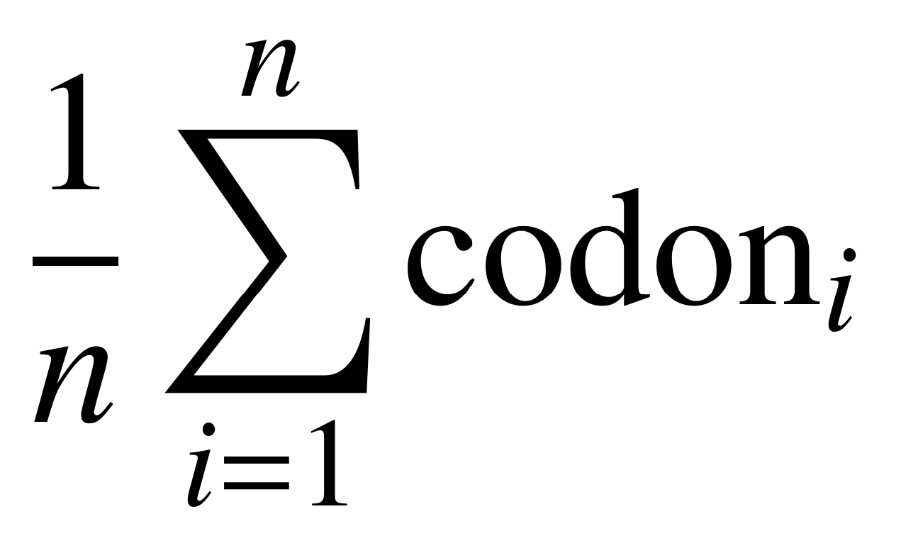

# trnaExpCodAdapt
tRNA Expression-Codon Adaptation

## GM-tECA and percentage of anticodon:codon base paring

The **GM-tECA** (Geometric Mean of tRNA Expression Adaptation) is calculated using the following formula, which represents the geometric mean of the tRNA abundances that decode each codon in a coding sequence (CDS):

where:
* **n:** Total number of codons in the CDS.
* **codons:** Vector of length *n* indexed by codon sequences. Each item contains the tRNA abundance that pairs with the corresponding codon.
* **i:** Index in the vector *codons*.

**Higher GM-tECA values** indicate that the CDS is enriched in codons recognized by the most abundant tRNAs. **Lower GM-tECA values** imply the opposite.

## GM-tECA calculation protocol

### Requirements

Input files:
* **FASTA file:** Contains target coding sequences (CDSs) (e.g., Dm28c_CDSs.fasta). Format: standard FASTA with headers (e.g., ">geneID").
* **tRNA abundance data:** Derived from tRNA-seq experiments. File: tRNA abundance (tab-delimited, text format) (e.g., codon_tRNA_abundance.txt). Contains tRNA abundances that pair with their corresponding codons.

The GM-tECA and percentage of  anticodon:codon
base pairing values were obtained using the python script available in https://github.com/trypchromics/trnaExpCodAdapt.
First, the sapply function in R 4.3.1 was used to map each codon from
the T. cruzi (Dm28c) CDSs nucleotide sequence to its corresponding abundance
value from the tRNA expression data. The geometric
mean of codon values for each CDS in a FASTA file was calculated using the
custom function geom_avg_codons in R, based on input codon table to calculate
the GM-tECA values. The table included 61 codon triplets with corresponding
values for tRNA abundance, renormalized according to the item “Codon usage
analysis in the T. cruzi Dm28c genome”. To avoid numerical underflow during the calculation of the geometric mean, each value was multiplied by 100 before computing the product. This step was taken not just to avoid very small numbers, but to prevent the result from becoming smaller than what the computer can accurately represent using floating-point arithmetic. When multiplying many small values, the result can become so close to zero that it is rounded to zero by the computer, leading to inaccurate or undefined results. Scaling the values helps maintain numerical stability and ensures reliable computation.

To calculate the percentage of target
anticodon:codon pairing modes, we used
a table containing all the same 61 codon triplets. For each codon corresponding
to the specific pairing mode, a value of 1 was assigned instead of tRNA
abundance. All other codons, which were not targets of this pairing, were
assigned a value of 0. Subsequently, the arithmetic mean of the codon values
for each CDS was calculated using the arithm_avg_codons function in R, rather
than the geometric mean. These arithmetic mean values represent the percentage
of the target pairing mode for each sequence.

